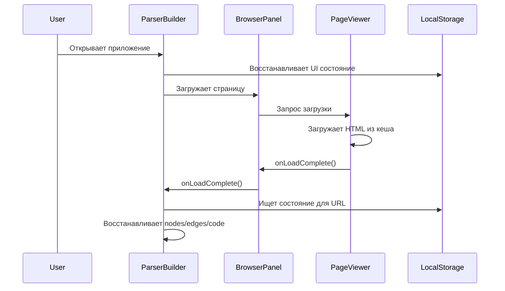

# Восстановление состояния редактора нод и кода

## Описание функциональности

Приложение теперь автоматически сохраняет и восстанавливает состояние редактора нод и сгенерированного кода при работе с кешированными страницами.

## Что сохраняется

### Состояние редактора нод:
- **nodes**: Массив узлов графа парсера
- **edges**: Массив связей между узлами

### Сгенерированный код:
- **generatedCode**: Сгенерированный Rust код парсера
- **editedCode**: Отредактированный пользователем код

## Как работает сохранение

### Автоматическое сохранение:
- Состояние сохраняется автоматически при каждом изменении `nodes`, `edges`, `generatedCode` или `editedCode`
- Сохранение привязано к URL страницы для раздельного хранения состояний разных сайтов
- Используется `localStorage` с ключами вида `parser-builder-ui-state_[base64-encoded-url]`

### Формат хранения:
```typescript
interface ParserBuilderUIState {
  version: number;           // Версия формата (текущая: 3)
  nodes: Node[];             // Узлы редактора
  edges: Edge[];             // Связи между узлами
  generatedCode: string;     // Сгенерированный код
  editedCode: string;        // Отредактированный код
  stateUrl: string;          // URL страницы для привязки состояния
  chatId?: string | null;    // ID чата для дополнительной привязки
  // ... остальные UI настройки
}
```

## Восстановление состояния

### При запуске приложения:
1. Восстанавливаются общие UI настройки (размеры панелей, видимость и т.д.)
2. При выборе сайта автоматически загружается его URL

### При загрузке страницы:
1. После успешной загрузки страницы проверяется наличие сохраненного состояния для этого URL
2. Если состояние найдено, восстанавливаются:
   - Узлы и связи редактора нод
   - Сгенерированный и отредактированный код

### Приоритет восстановления:
1. Сначала ищется состояние для конкретного URL
2. Если не найдено, используется общее состояние приложения

## Миграция данных

### Версия 3 (текущая):
- Добавлена поддержка сохранения состояния нод и кода
- Добавлена привязка состояния к URL страницы
- Добавлена привязка состояния к ID чата для контекстной работы

### Миграция с предыдущих версий:
- Автоматически конвертирует старые форматы в новый
- Сохраняет обратную совместимость

## Технические детали

### Ключевые компоненты:

1. **`useParserBuilderState.ts`**:
   - `ParserBuilderUIState` - интерфейс состояния
   - `saveUIState()` - сохранение состояния
   - `restoreUIState(url?)` - восстановление состояния
   - `migrateUIState()` - миграция между версиями

2. **`ParserBuilder.svelte`**:
   - `$effect` для автоматического сохранения при изменениях
   - Восстановление состояния при загрузке страницы
   - Интеграция с `BrowserPanel` для колбеков загрузки

3. **`BrowserPanel.svelte`**:
   - Передача `onLoadComplete` колбека в `PageViewer`
   - Триггер восстановления состояния после загрузки страницы

### Процесс работы:



## Исправления и улучшения

### Исправление ошибок дублирования функций:
- **Проблема**: Конфликты между импортированными функциями `saveUIState`/`restoreUIState` и локальными функциями с теми же именами
- **Решение**: Удалены локальные функции `saveUIState` и `restoreUIState`, логика восстановления встроена в `onMount`
- **Результат**: Устранены ошибки компиляции, код стал более чистым и последовательным

## Привязка состояния к чату

### Новая функциональность (версия 3):
- **Привязка к ID чата**: Каждому чату соответствует своё состояние парсера
- **Независимое хранение**: Переключение между чатами восстанавливает соответствующее состояние
- **Контекстная работа**: Разные чаты могут иметь разные конфигурации парсера

### Как работает:
1. **При переключении чата**: Автоматически восстанавливается состояние нод и кода для этого чата
2. **Привязка к URL + ChatID**: Ключи вида `parser-builder-ui-state_[url]_[chatId]`
3. **Fallback логика**: Если нет состояния для чата, используется состояние для URL

### Пример использования:
```typescript
// При переключении чата
onChatChange={(chatId) => {
  currentChatId = chatId;
  // Состояние автоматически восстановится через $effect
}}
```

## Преимущества

### Для пользователей:
- **Непрерывная работа**: Состояние парсера сохраняется между сессиями
- **Раздельное хранение**: Каждому сайту соответствует свое состояние
- **Автоматическое восстановление**: Не нужно вручную восстанавливать работу

### Для разработчиков:
- **Автоматическая сериализация**: Прозрачное сохранение сложных структур данных через `$effect`
- **Версионирование**: Поддержка миграций между версиями формата
- **Типобезопасность**: Полная типизация всех сохраняемых данных
- **Автосохранение**: Нет необходимости вручную вызывать функции сохранения
- **Устранены конфликты имён**: Импортированные функции имеют приоритет над локальными
- **Привязка к чату**: Состояние сохраняется отдельно для каждого чата

## Использование в коде

### Сохранение состояния:
```typescript
// Автоматически сохраняется при изменениях в $effect
$effect(() => {
  if (currentUrl) {
    saveUIState({
      nodes,
      edges,
      generatedCode,
      editedCode,
      stateUrl: currentUrl,
    });
  }
});
```

### Восстановление состояния:
```typescript
// При загрузке страницы
onLoadComplete={() => {
  const pageState = restoreUIState(currentUrl);
  if (pageState) {
    nodes = pageState.nodes;
    edges = pageState.edges;
    generatedCode = pageState.generatedCode;
    editedCode = pageState.editedCode;
  }
}}
```

## Отладка

### Просмотр сохраненного состояния:
```javascript
// В консоли браузера
Object.keys(localStorage).filter(key => key.startsWith('parser-builder-ui-state'))
```

### Очистка состояния:
```javascript
// Удалить состояние для всех страниц
Object.keys(localStorage)
  .filter(key => key.startsWith('parser-builder-ui-state'))
  .forEach(key => localStorage.removeItem(key));
```
